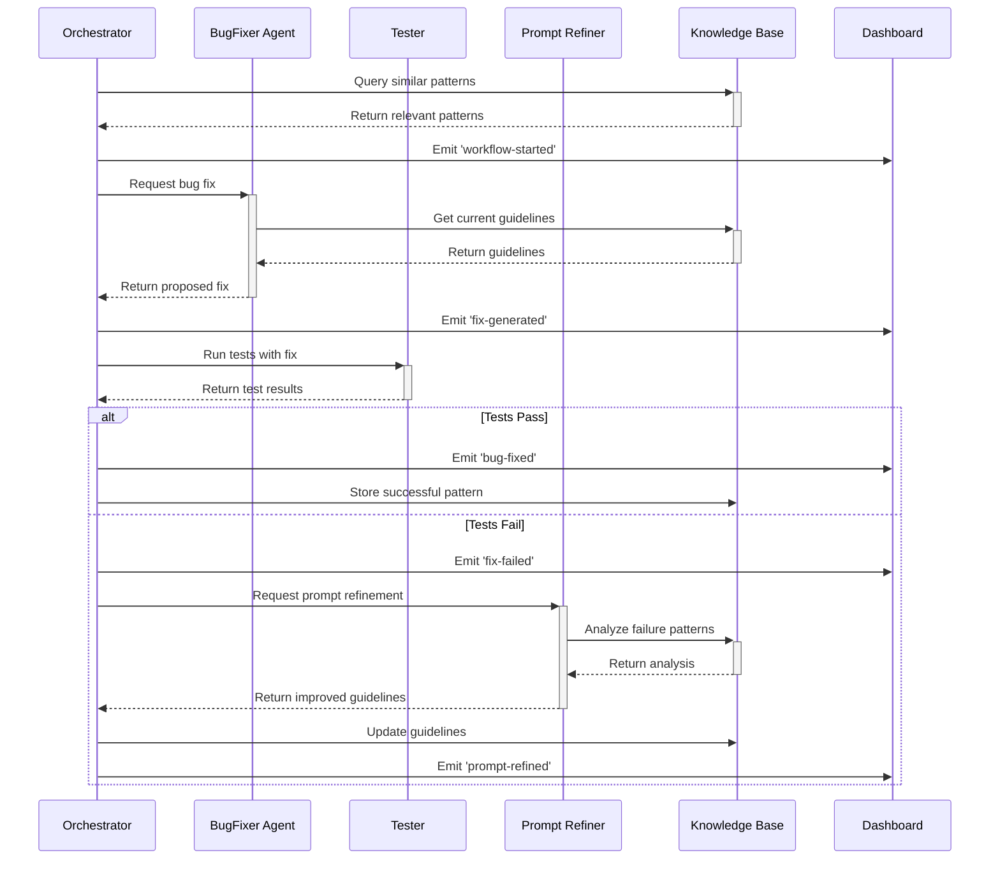

# Architectural Design Document

## 🏛️ System Architecture Overview

This document details the architectural decisions and design patterns that ensure the bug-fixing agent is extensible, maintainable, and scalable.

## 🎯 Design Principles

### 1. Separation of Concerns

Each module has a single, well-defined responsibility:

- **Orchestrator**: Workflow coordination only
- **Agents**: Domain-specific intelligence (bug-fixing, prompt refinement)
- **Knowledge Base**: Data persistence and retrieval
- **Testing**: Test execution and result parsing
- **Dashboard**: User interface and monitoring

### 2. Dependency Inversion

High-level modules don't depend on low-level modules. Both depend on abstractions:

```typescript
// ❌ Bad: Direct dependency on implementation
class BugFixerAgent {
  private claude: ClaudeAPI; // Tightly coupled
}

// ✅ Good: Dependency on abstraction
class BugFixerAgent {
  constructor(private llm: LLMProvider) {} // Loosely coupled
}
```

### 3. Event-Driven Architecture

Components communicate through events, enabling loose coupling:

```typescript
// src/shared/event-bus.ts
export interface SystemEvents {
  "bug-fix-attempted": { scenario: BugScenario; attempt: FixAttempt };
  "test-results-ready": { results: TestResult[]; commitHash: string };
  "prompt-refined": { newGuidelines: string[]; version: number };
  "human-intervention-requested": { scenario: BugScenario; reason: string };
}

export class EventBus extends EventEmitter<SystemEvents> {
  // Type-safe event emission and handling
}
```

### 4. Plugin Architecture

Core system can be extended without modification:

```typescript
// src/plugins/types.ts
export interface Plugin {
  name: string;
  version: string;

  // Lifecycle hooks
  initialize?(context: PluginContext): Promise<void>;
  beforeBugFix?(scenario: BugScenario): Promise<void>;
  afterBugFix?(result: BugFixResult): Promise<void>;

  // Extension points
  customLLMProvider?(): LLMProvider;
  customTestRunner?(): TestRunner;
  customAnalyzers?(): CodeAnalyzer[];
}
```

## 🔧 Core Abstractions

### LLM Provider Interface

Enables swapping between different language models:

```typescript
// src/shared/llm-provider.ts
export interface LLMProvider {
  name: string;
  capabilities: LLMCapabilities;

  generateCompletion(request: CompletionRequest): Promise<CompletionResponse>;
  generateStructuredOutput<T>(request: StructuredRequest<T>): Promise<T>;

  // Cost and performance tracking
  getUsageStats(): Promise<UsageStats>;
  estimateCost(request: CompletionRequest): Promise<number>;
}

export interface LLMCapabilities {
  maxTokens: number;
  supportsStreaming: boolean;
  supportsTools: boolean;
  costPerToken: number;
}
```

### Test Framework Abstraction

Supports multiple testing frameworks:

```typescript
// src/testing/test-framework.ts
export interface TestFramework {
  name: string;

  detectFramework(projectPath: string): Promise<boolean>;
  runTests(options: TestRunOptions): Promise<TestResult[]>;
  parseFailures(output: string): Promise<TestFailure[]>;

  // Framework-specific optimizations
  getRelevantTests(changedFiles: string[]): Promise<string[]>;
  supportsWatchMode(): boolean;
}
```

### Knowledge Storage Interface

Pluggable storage backends:

```typescript
// src/knowledge/storage.ts
export interface KnowledgeStorage {
  // Pattern storage
  storePattern(pattern: FixPattern): Promise<string>;
  findSimilarPatterns(query: PatternQuery): Promise<FixPattern[]>;

  // Guideline management
  storeGuideline(guideline: Guideline): Promise<void>;
  getActiveGuidelines(context?: string[]): Promise<Guideline[]>;

  // Metrics and analytics
  recordMetric(metric: Metric): Promise<void>;
  queryMetrics(query: MetricQuery): Promise<Metric[]>;
}
```

## 🔄 Event Flow Architecture

### Bug Fixing Workflow Events



## 📊 Data Flow & State Management

### State Isolation

Each component manages its own state with clear interfaces:

```typescript
// src/shared/state-manager.ts
export class ComponentState<T> {
  private state: T;
  private listeners: ((state: T) => void)[] = [];

  get current(): Readonly<T> {
    return this.state;
  }

  update(updater: (current: T) => T): void {
    this.state = updater(this.state);
    this.notifyListeners();
  }

  subscribe(listener: (state: T) => void): () => void {
    this.listeners.push(listener);
    return () =>
      (this.listeners = this.listeners.filter((l) => l !== listener));
  }
}
```

### Workflow State Machine

Bug fixing workflow as a finite state machine:

```typescript
// src/orchestrator/workflow-state.ts
export enum WorkflowState {
  IDLE = "idle",
  ANALYZING_COMMITS = "analyzing_commits",
  CHECKING_OUT = "checking_out",
  RUNNING_TESTS = "running_tests",
  GENERATING_FIX = "generating_fix",
  APPLYING_FIX = "applying_fix",
  REFINING_PROMPT = "refining_prompt",
  COMPLETED = "completed",
  ERROR = "error",
}

export class WorkflowStateMachine {
  private state = WorkflowState.IDLE;
  private context: WorkflowContext = {};

  transition(
    newState: WorkflowState,
    context?: Partial<WorkflowContext>
  ): void {
    if (!this.isValidTransition(this.state, newState)) {
      throw new Error(`Invalid transition: ${this.state} -> ${newState}`);
    }

    this.state = newState;
    this.context = { ...this.context, ...context };
    this.emit("state-changed", { state: newState, context: this.context });
  }
}
```

## 🧩 Extension Points

### 1. Custom Code Analyzers

Add domain-specific bug detection logic:

```typescript
// src/plugins/analyzers/security-analyzer.ts
export class SecurityAnalyzer implements CodeAnalyzer {
  async analyzeCode(code: string, context: AnalysisContext): Promise<Analysis> {
    // Custom security vulnerability detection
    return {
      issues: await this.detectSecurityIssues(code),
      suggestions: await this.generateSecurityFixes(code),
      confidence: this.calculateConfidence(code),
    };
  }
}
```

### 2. Custom Metrics Collectors

Track domain-specific metrics:

```typescript
// src/plugins/metrics/performance-metrics.ts
export class PerformanceMetricsCollector implements MetricsCollector {
  async collectMetrics(
    scenario: BugScenario,
    result: BugFixResult
  ): Promise<void> {
    // Track performance-related metrics
    await this.recordExecutionTime(result);
    await this.trackMemoryUsage(scenario);
    await this.analyzeComplexityReduction(scenario, result);
  }
}
```

### 3. Custom Learning Strategies

Implement alternative learning approaches:

```typescript
// src/plugins/learning/reinforcement-learning.ts
export class ReinforcementLearner implements LearningStrategy {
  async updateStrategy(
    scenario: BugScenario,
    attempts: FixAttempt[],
    outcome: BugFixOutcome
  ): Promise<StrategyUpdate> {
    // Implement Q-learning or similar RL algorithm
    return {
      actionRewards: await this.calculateRewards(attempts, outcome),
      policyUpdates: await this.updatePolicy(scenario, attempts),
      explorationRate: this.adjustExploration(outcome),
    };
  }
}
```

## 🔒 Security & Safety Considerations

### Code Execution Safety

- **Sandboxing**: Run tests in isolated containers
- **Resource Limits**: CPU and memory constraints on test execution
- **Code Review**: Human approval for production deployments

### API Security

```typescript
// src/shared/security.ts
export class APISecurityManager {
  private rateLimiter = new RateLimiter();
  private tokenValidator = new TokenValidator();

  async validateRequest(request: APIRequest): Promise<boolean> {
    // Rate limiting
    await this.rateLimiter.checkLimit(request.clientId);

    // Token validation
    const isValidToken = await this.tokenValidator.validate(request.token);

    // Input sanitization
    this.sanitizeInputs(request.payload);

    return isValidToken;
  }
}
```

### Data Privacy

- **No Code Leakage**: Ensure LLM providers don't store proprietary code
- **Audit Logging**: Track all LLM interactions for compliance
- **Local Processing**: Option to run entirely offline with local models

## 🚀 Scalability Patterns

### Horizontal Scaling

```typescript
// src/orchestrator/distributed-coordinator.ts
export class DistributedCoordinator {
  private workers: WorkerPool;
  private jobQueue: JobQueue;

  async distributeWork(bugScenarios: BugScenario[]): Promise<void> {
    // Distribute bug-fixing tasks across multiple workers
    const jobs = bugScenarios.map((scenario) => ({
      type: "fix-bug",
      payload: scenario,
      priority: this.calculatePriority(scenario),
    }));

    await this.jobQueue.addJobs(jobs);
    await this.workers.processJobs();
  }
}
```

### Caching Strategy

```typescript
// src/shared/cache-manager.ts
export class CacheManager {
  private llmCache = new LRUCache<string, CompletionResponse>();
  private testCache = new LRUCache<string, TestResult[]>();

  async getCachedCompletion(
    prompt: string
  ): Promise<CompletionResponse | null> {
    const cacheKey = this.generateCacheKey(prompt);
    return this.llmCache.get(cacheKey) || null;
  }

  async cacheCompletion(
    prompt: string,
    response: CompletionResponse
  ): Promise<void> {
    const cacheKey = this.generateCacheKey(prompt);
    this.llmCache.set(cacheKey, response);
  }
}
```

## 📋 Quality Assurance

### Testing Strategy

1. **Unit Tests**: Individual component logic
2. **Integration Tests**: Component interactions
3. **End-to-End Tests**: Full workflow validation
4. **Property-Based Tests**: Edge case discovery
5. **Performance Tests**: Scalability validation

### Code Quality Gates

```typescript
// src/quality/quality-gates.ts
export class QualityGates {
  async validateFix(
    fix: CodeFix,
    scenario: BugScenario
  ): Promise<QualityReport> {
    const report = new QualityReport();

    // Static analysis
    report.addCheck("syntax", await this.checkSyntax(fix.code));
    report.addCheck("types", await this.checkTypes(fix.code));
    report.addCheck("complexity", await this.checkComplexity(fix.code));

    // Semantic validation
    report.addCheck("tests-pass", await this.runTests(fix));
    report.addCheck("no-regression", await this.checkRegression(fix, scenario));

    return report;
  }
}
```

### Monitoring & Observability

```typescript
// src/monitoring/observability.ts
export class ObservabilityStack {
  private metrics = new MetricsCollector();
  private tracer = new RequestTracer();
  private logger = new StructuredLogger();

  async instrumentWorkflow(workflow: WorkflowEngine): Promise<void> {
    // Add instrumentation to track performance, errors, and usage
    workflow.on("bug-fix-started", (scenario) => {
      this.tracer.startSpan("bug-fix", { scenario });
      this.metrics.increment("bugs.attempted");
    });

    workflow.on("bug-fix-completed", (result) => {
      this.tracer.finishSpan();
      this.metrics.increment("bugs.fixed");
      this.metrics.recordDuration("fix.duration", result.duration);
    });
  }
}
```

## 🔮 Future Architecture Considerations

### Multi-Tenancy

- **Workspace Isolation**: Separate environments per project/team
- **Resource Quotas**: Fair usage limits per tenant
- **Custom Configurations**: Tenant-specific settings and plugins

### Machine Learning Pipeline

- **Data Pipeline**: Automated training data collection and validation
- **Model Versioning**: Track and rollback model improvements
- **A/B Testing**: Compare different approaches scientifically

### Integration Ecosystem

- **IDE Plugins**: Direct integration with development environments
- **CI/CD Integration**: Automated bug fixing in deployment pipelines
- **Issue Tracker Integration**: Automatic bug report resolution

This architecture provides a solid foundation for building an extensible, maintainable, and scalable autonomous bug-fixing agent while maintaining flexibility for future enhancements and use cases.
