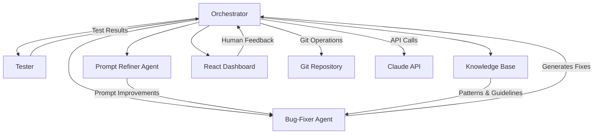

# Autonomous Bug-Fixing Agent

> An intelligent, self-improving agent that learns to fix software bugs by analyzing commit history and iteratively refining its debugging strategies.

## 🎯 Overview

This project implements an autonomous bug-fixing agent that uses large language models (LLMs) to automatically identify and fix software bugs. The agent learns from historical bug fixes in a repository's commit history, gradually improving its debugging capabilities through self-reflection and prompt evolution.

### Key Features

- **Autonomous Bug Detection & Fixing**: Automatically identifies failing tests and generates code fixes
- **Self-Improving Architecture**: Learns from failures using meta-learning and prompt refinement
- **Multi-Agent Collaboration**: Specialized agents for programming, testing, and strategy refinement
- **Historical Learning**: Trains on repository's commit history to understand project-specific patterns
- **Real-time Monitoring**: React dashboard for observing agent behavior and human intervention
- **Extensible Design**: Modular architecture supporting multiple LLM providers and testing frameworks

## 🏗️ System Architecture

### Core Components



#### 1. Orchestrator (`src/orchestrator/`)

**Primary Controller** - Coordinates the entire bug-fixing workflow

- **Responsibilities**: Git operations, workflow management, agent coordination
- **Technologies**: TypeScript, Node.js, simple-git
- **Key Modules**:
  - `CommitAnalyzer` - Identifies bug-fix commits from history
  - `GitManager` - Handles repository state and commit navigation
  - `WorkflowEngine` - Manages the bug-fixing iteration loop

#### 2. Bug-Fixer Agent (`src/agents/bug-fixer/`)

**Programmer Agent** - Generates code fixes using LLM

- **Responsibilities**: Code analysis, bug diagnosis, fix generation
- **Technologies**: Claude API, TypeScript, AST parsing
- **Key Modules**:
  - `CodeAnalyzer` - Analyzes failing tests and error context
  - `FixGenerator` - Produces targeted code modifications
  - `DiffApplicator` - Applies generated fixes to codebase

#### 3. Tester (`src/testing/`)

**Test Execution Engine** - Runs tests and captures results

- **Responsibilities**: Test execution, result parsing, failure analysis
- **Technologies**: Jest, Mocha, or project-specific test runners
- **Key Modules**:
  - `TestRunner` - Executes test suites with configurable runners
  - `ResultParser` - Extracts meaningful failure information
  - `CoverageAnalyzer` - Tracks test coverage and affected code

#### 4. Prompt Refiner Agent (`src/agents/prompt-refiner/`)

**Meta-Learning Agent** - Improves bug-fixing strategies

- **Responsibilities**: Failure analysis, prompt optimization, strategy refinement
- **Technologies**: Claude API, pattern recognition
- **Key Modules**:
  - `FailureAnalyzer` - Compares agent attempts with actual fixes
  - `PromptEvolution` - Generates improved prompts and guidelines
  - `StrategyOptimizer` - Refines debugging approaches

#### 5. Knowledge Base (`src/knowledge/`)

**Pattern Storage System** - Maintains learned debugging patterns

- **Responsibilities**: Pattern storage, retrieval, and organization
- **Technologies**: SQLite/PostgreSQL, vector embeddings
- **Key Modules**:
  - `PatternStore` - Stores successful fix patterns and heuristics
  - `GuidelineManager` - Manages accumulated debugging guidelines
  - `SimilarityEngine` - Finds relevant patterns for current bugs

#### 6. React Dashboard (`src/dashboard/`)

**Monitoring Interface** - Real-time visualization and human intervention

- **Responsibilities**: Progress monitoring, manual intervention, metrics display
- **Technologies**: React, TypeScript, WebSocket/Server-Sent Events
- **Key Components**:
  - `WorkflowMonitor` - Real-time workflow status and progress
  - `CodeViewer` - Side-by-side diff visualization
  - `MetricsDashboard` - Success rates and performance analytics
  - `InterventionPanel` - Human-in-the-loop controls

## 🚀 Implementation Roadmap

### Phase 1: Foundation & Core Infrastructure

#### 1.1 Project Setup & Dependencies

```bash
# Core dependencies to install
npm install typescript node-sass
npm install simple-git child_process
npm install @anthropic-ai/sdk
npm install jest @types/jest
npm install express cors helmet
npm install react react-dom @types/react
npm install sqlite3 better-sqlite3
npm install winston pino-pretty
```

**Implementation Steps:**

1. **Project Structure Setup**

   ```
   src/
   ├── orchestrator/          # Main workflow controller
   ├── agents/               # LLM-powered agents
   │   ├── bug-fixer/       # Code fixing agent
   │   └── prompt-refiner/  # Meta-learning agent
   ├── testing/             # Test execution engine
   ├── knowledge/           # Pattern storage system
   ├── dashboard/           # React monitoring UI
   ├── shared/              # Shared utilities and types
   └── config/              # Configuration management
   ```

2. **Core Type Definitions**

   ```typescript
   // src/shared/types.ts
   interface BugScenario {
     buggyCommit: string;
     fixCommit: string;
     failingTests: TestFailure[];
     affectedFiles: string[];
   }

   interface FixAttempt {
     attempt: number;
     diff: string;
     testResults: TestResult[];
     success: boolean;
     timestamp: Date;
   }

   interface PromptEvolution {
     version: number;
     guidelines: string[];
     successRate: number;
     addedGuidelines: string[];
   }
   ```

3. **Configuration Management**
   ```typescript
   // src/config/config.ts
   interface Config {
     llm: {
       provider: "claude" | "openai";
       apiKey: string;
       model: string;
       maxTokens: number;
     };
     testing: {
       framework: "jest" | "mocha" | "vitest";
       command: string;
       timeout: number;
     };
     repository: {
       path: string;
       maxCommits: number;
       bugPatterns: string[];
     };
   }
   ```

#### 1.2 Git Integration Module

```typescript
// src/orchestrator/git-manager.ts
export class GitManager {
  async identifyBugFixCommits(maxCommits: number): Promise<BugScenario[]>;
  async checkoutCommit(commitHash: string): Promise<void>;
  async getCurrentBranch(): Promise<string>;
  async createWorkingBranch(name: string): Promise<void>;
  async getCommitDiff(commitHash: string): Promise<string>;
  async getAffectedFiles(commitHash: string): Promise<string[]>;
}
```

#### 1.3 Basic Test Runner

```typescript
// src/testing/test-runner.ts
export class TestRunner {
  async runTests(): Promise<TestResult[]>;
  async parseTestOutput(output: string): Promise<TestFailure[]>;
  async getFailureContext(failure: TestFailure): Promise<string>;
}
```

### Phase 2: LLM Integration & Bug-Fixer Agent

#### 2.1 LLM Provider Abstraction

```typescript
// src/shared/llm-provider.ts
interface LLMProvider {
  generateCompletion(prompt: string, systemPrompt: string): Promise<string>;
  generateStructuredOutput<T>(prompt: string, schema: T): Promise<T>;
}

export class ClaudeProvider implements LLMProvider {
  // Claude-specific implementation
}

export class OpenAIProvider implements LLMProvider {
  // OpenAI-specific implementation
}
```

#### 2.2 Bug-Fixer Agent Implementation

```typescript
// src/agents/bug-fixer/bug-fixer-agent.ts
export class BugFixerAgent {
  private llm: LLMProvider;
  private currentPrompt: PromptTemplate;

  async analyzeBug(
    failure: TestFailure,
    codeContext: string
  ): Promise<BugAnalysis>;
  async generateFix(analysis: BugAnalysis): Promise<CodeFix>;
  async updatePrompt(newGuidelines: string[]): Promise<void>;
}
```

#### 2.3 Code Context Extraction

```typescript
// src/agents/bug-fixer/code-analyzer.ts
export class CodeAnalyzer {
  async extractRelevantCode(testFailure: TestFailure): Promise<string>;
  async getStackTraceContext(stackTrace: string): Promise<CodeContext>;
  async identifyLikelyBugLocation(
    error: string,
    files: string[]
  ): Promise<string[]>;
}
```

### Phase 3: Prompt Refiner & Meta-Learning

#### 3.1 Failure Analysis Engine

```typescript
// src/agents/prompt-refiner/failure-analyzer.ts
export class FailureAnalyzer {
  async compareAttemptWithActual(
    agentDiff: string,
    actualDiff: string,
    testResults: TestResult[]
  ): Promise<FailureAnalysis>;

  async identifyMissedPatterns(failures: FailureAnalysis[]): Promise<string[]>;
}
```

#### 3.2 Prompt Evolution System

```typescript
// src/agents/prompt-refiner/prompt-refiner-agent.ts
export class PromptRefinerAgent {
  private llm: LLMProvider;

  async analyzeFailure(
    scenario: BugScenario,
    attempts: FixAttempt[],
    actualFix: string
  ): Promise<PromptImprovement>;

  async generateNewGuidelines(analysis: FailureAnalysis): Promise<string[]>;

  async optimizePromptStructure(
    currentPrompt: PromptTemplate,
    improvements: PromptImprovement[]
  ): Promise<PromptTemplate>;
}
```

### Phase 4: Knowledge Base & Pattern Storage

#### 4.1 Pattern Recognition System

```typescript
// src/knowledge/pattern-store.ts
export class PatternStore {
  async storeSuccessfulFix(
    fix: FixAttempt,
    context: BugScenario
  ): Promise<void>;
  async findSimilarBugs(currentBug: BugScenario): Promise<FixPattern[]>;
  async updatePatternSuccess(
    patternId: string,
    success: boolean
  ): Promise<void>;
}
```

#### 4.2 Guideline Management

```typescript
// src/knowledge/guideline-manager.ts
export class GuidelineManager {
  async addGuideline(guideline: string, source: string): Promise<void>;
  async getActiveGuidelines(): Promise<string[]>;
  async scoreGuidelineEffectiveness(): Promise<GuidelineScore[]>;
  async pruneIneffectiveGuidelines(): Promise<void>;
}
```

### Phase 5: Orchestration & Workflow Engine

#### 5.1 Main Workflow Controller

```typescript
// src/orchestrator/workflow-engine.ts
export class WorkflowEngine {
  private gitManager: GitManager;
  private bugFixer: BugFixerAgent;
  private promptRefiner: PromptRefinerAgent;
  private testRunner: TestRunner;
  private knowledgeBase: PatternStore;

  async processCommitHistory(): Promise<void>;
  async fixSingleBug(scenario: BugScenario): Promise<BugFixResult>;
  async handleFixFailure(
    scenario: BugScenario,
    attempts: FixAttempt[]
  ): Promise<void>;
}
```

#### 5.2 Progress Tracking & Metrics

```typescript
// src/orchestrator/metrics-collector.ts
export class MetricsCollector {
  async recordAttempt(attempt: FixAttempt): Promise<void>;
  async calculateSuccessRate(): Promise<number>;
  async generateProgressReport(): Promise<ProgressReport>;
  async exportMetrics(format: "json" | "csv" | "markdown"): Promise<string>;
}
```

### Phase 6: React Dashboard & Monitoring

#### 6.1 Real-time Communication

```typescript
// src/dashboard/websocket-server.ts
export class DashboardServer {
  private wss: WebSocketServer;

  async broadcastProgress(update: ProgressUpdate): Promise<void>;
  async handleHumanIntervention(intervention: Intervention): Promise<void>;
}
```

#### 6.2 Dashboard Components

```typescript
// src/dashboard/components/WorkflowMonitor.tsx
export const WorkflowMonitor: React.FC = () => {
  // Real-time workflow status display
  // Current commit, failing tests, agent attempts
  // Progress through commit history
};

// src/dashboard/components/CodeViewer.tsx
export const CodeViewer: React.FC<{ diff: string }> = ({ diff }) => {
  // Side-by-side diff visualization
  // Syntax highlighting, line numbers
  // Original vs. agent's proposed fix
};
```

### Phase 7: Testing & Optimization

#### 7.1 Comprehensive Test Suite

```typescript
// tests/integration/workflow.test.ts
describe("Bug Fixing Workflow", () => {
  it("should successfully fix simple bugs", async () => {
    // Test with known simple bugs
  });

  it("should improve prompts after failures", async () => {
    // Test meta-learning capabilities
  });

  it("should handle edge cases gracefully", async () => {
    // Test error handling and recovery
  });
});
```

#### 7.2 Performance Optimization

- **LLM Call Optimization**: Implement caching and request batching
- **Code Context Reduction**: Smart context trimming to stay within token limits
- **Parallel Processing**: Process multiple commits concurrently where possible

### Phase 8: Advanced Features & Extensions

#### 8.1 Multi-Language Support

```typescript
// src/shared/language-detector.ts
export class LanguageDetector {
  async detectProjectLanguage(path: string): Promise<Language>;
  async getLanguageSpecificRules(language: Language): Promise<string[]>;
}
```

#### 8.2 Plugin System

```typescript
// src/plugins/plugin-manager.ts
interface Plugin {
  name: string;
  version: string;
  hooks: PluginHooks;
}

export class PluginManager {
  async loadPlugin(pluginPath: string): Promise<void>;
  async executeHook(hookName: string, data: any): Promise<any>;
}
```

## 🔧 Configuration

### Environment Variables

```bash
# LLM Configuration
CLAUDE_API_KEY=your_claude_api_key
LLM_PROVIDER=claude
LLM_MODEL=claude-3-5-sonnet-20241022

# Repository Settings
REPO_PATH=/path/to/target/repository
MAX_COMMITS=100
BUG_PATTERNS="fix,bug,patch"

# Testing Configuration
TEST_FRAMEWORK=jest
TEST_COMMAND="npm test"
TEST_TIMEOUT=30000

# Dashboard Settings
DASHBOARD_PORT=3000
WEBSOCKET_PORT=3001
```

### Configuration File

```typescript
// config/default.json
{
  "llm": {
    "provider": "claude",
    "model": "claude-3-5-sonnet-20241022",
    "maxTokens": 4000,
    "temperature": 0.1
  },
  "workflow": {
    "maxAttemptsPerBug": 5,
    "maxPromptRefinements": 10,
    "parallelProcessing": false
  },
  "knowledge": {
    "database": "sqlite",
    "retentionDays": 365,
    "similarityThreshold": 0.8
  }
}
```

## 📊 Metrics & Evaluation

### Success Metrics

- **Fix Success Rate**: Percentage of bugs successfully fixed
- **Attempts Per Bug**: Average number of attempts needed
- **Prompt Evolution**: Number of guidelines learned over time
- **Time Efficiency**: Average time per bug fix
- **Diff Quality**: Similarity to human fixes (minimal, targeted changes)

### Monitoring Dashboard Features

- Real-time progress through commit history
- Success rate trends over time
- Most effective prompt guidelines
- Failed attempt analysis
- Human intervention frequency

## 🎯 Design Principles

### Extensibility

- **Modular Architecture**: Each component can be replaced independently
- **Plugin System**: Easy integration of new LLM providers, testing frameworks
- **Configuration-Driven**: Behavior controlled through configuration files
- **Event-Driven**: Loose coupling through event emitters

### Maintainability

- **Strong Typing**: Comprehensive TypeScript interfaces and types
- **Comprehensive Testing**: Unit, integration, and end-to-end tests
- **Clear Documentation**: Inline comments and architectural decision records
- **Logging & Monitoring**: Detailed logs for debugging and analysis

### Reliability

- **Error Handling**: Graceful degradation and recovery mechanisms
- **State Management**: Proper cleanup and rollback capabilities
- **Resource Management**: Token usage tracking and rate limiting
- **Data Persistence**: Reliable storage of learning progress

## 🚀 Quick Start

### Prerequisites

- Node.js 18+
- TypeScript 5+
- Git repository with test suite
- Claude API key

### Installation

```bash
git clone <repository-url>
cd autonomous-bug-fixing-agent
npm install
npm run build

# Configure environment
cp .env.example .env
# Edit .env with your settings

# Run initial setup
npm run setup
```

### Usage

```bash
# Start the bug-fixing process
npm run fix-bugs

# Launch monitoring dashboard
npm run dashboard

# Export learning results
npm run export-results
```

## 🔮 Future Enhancements

### Advanced Capabilities

- **Multi-Repository Learning**: Apply learned patterns across projects
- **Continuous Integration**: Real-time bug fixing in CI/CD pipelines
- **Code Quality Analysis**: Integration with linting and security tools
- **Natural Language Bug Reports**: Fix bugs from human-written descriptions

### Research Opportunities

- **Transfer Learning**: Apply patterns from one codebase to another
- **Collaborative Agents**: Multiple specialized agents working together
- **Human-AI Collaboration**: Seamless handoff between AI and human developers
- **Explainable AI**: Clear reasoning behind fix decisions

## 📚 References

This implementation draws inspiration from recent research in autonomous code repair:

- **RepairAgent**: LLM-based autonomous program repair with iterative refinement
- **MarsCode Agent**: Multi-agent collaboration for automated bug fixing
- **Self-Improving Coding Agents**: Meta-learning approaches for prompt evolution
- **Code Researcher**: Leveraging commit history for bug resolution context

---

**License**: MIT  
**Maintainer**: [Your Name]  
**Version**: 1.0.0-alpha

For detailed implementation guides, see the `/docs` directory.
For contribution guidelines, see `CONTRIBUTING.md`.
For architectural decisions, see `docs/architecture/`.
